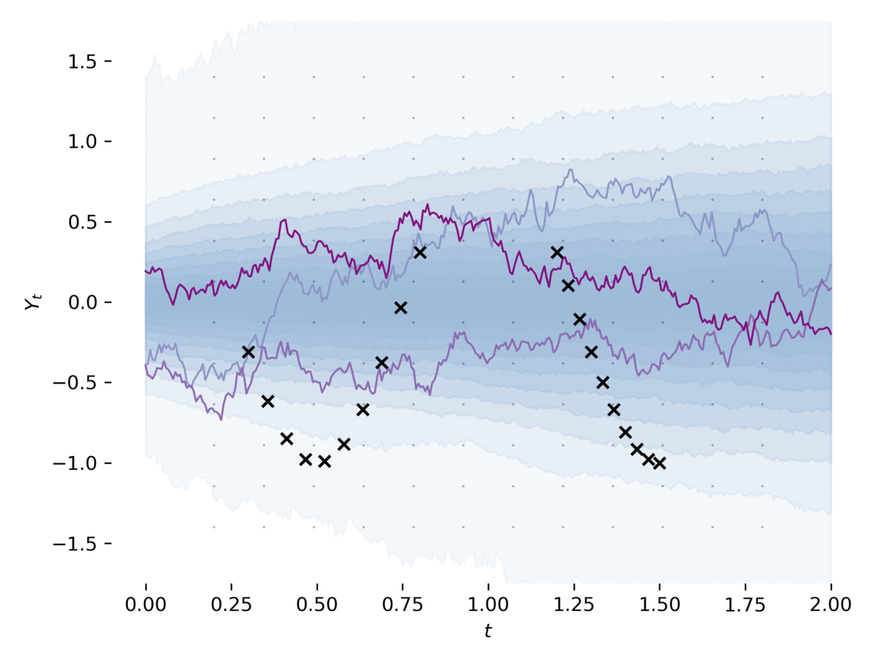

# PyTorch Implementation of Differentiable SDE Solvers
This codebase provides [stochastic differential equation (SDE)](https://en.wikipedia.org/wiki/Stochastic_differential_equation) solvers with GPU support and efficient sensitivity analysis.
Similar to [torchdiffeq](https://github.com/rtqichen/torchdiffeq), algorithms in this repository are fully supported to run on GPUs.

---
<p align="center">
  
</p>

## Installation
```shell script
pip install git+https://github.com/google-research/torchsde.git
```

## Examples
[`demo.ipynb`](examples/demo.ipynb) in the [`examples`](examples) folder is a short guide on how one may use the codebase for solving SDEs without considering gradient computation.
It covers subtle points such as fixing the randomness in the solver and the consequence of *noise types*.
Unlike with ordinary differential equation (ODE), where general high-order solvers can be applied, the numerical efficiency of SDE solvers highly depends on the assumption on the noise (i.e. assumptions on the diffusion function).
We encourage those who are interested in using this codebase to take a peek at the notebook.

[`latent_sde.py`](examples/latent_sde.py) in the [`examples`](examples) folder learns a *latent stochastic differential equation* (cf. Section 5 of [\[1\]](https://arxiv.org/pdf/2001.01328.pdf) and references therein).
The example fits an SDE to data, all the while regularizing it to be like an [Ornstein-Uhlenbeck](https://en.wikipedia.org/wiki/Ornstein%E2%80%93Uhlenbeck_process) prior process.
The model can be loosely viewed as a [variational autoencoder](https://en.wikipedia.org/wiki/Autoencoder#Variational_autoencoder_(VAE)) with its prior and approximate posterior being SDEs.
Note, the example contains many simplifications and is meant to demonstrate basic usage regarding gradient computation.

To run the latent SDE example, execute the following command from the root folder of this repo:
```shell script
python3 -m examples.latent_sde --train-dir ${TRAIN_DIR}
```
Once in a while, the program writes a figure to the path specified by `TRAIN_DIR`.
Training should stabilize after 500 iterations with the default hyperparameters.

## Usage
The central functions of interest are `sdeint` and `sdeint_adjoint`. They can be imported as follows:
```Python
from torchsde import sdeint, sdeint_adjoint
```

### Integrating SDEs
SDEs are defined with two vector fields, named respectively the *drift* and *diffusion* functions.
The drift is analogous to the vector field in ODEs, whereas the diffusion controls how the [Brownian motion](https://en.wikipedia.org/wiki/Brownian_motion) affects the system.

By default, solvers in the codebase integrate SDEs that are `torch.nn.Module` objects with the drift function `f` and diffusion function `g`.
For instance, the [Geometric Brownian motion](https://en.wikipedia.org/wiki/Geometric_Brownian_motion) can be integrated as follows:
```Python
import torch
from torchsde import sdeint


class SDE(torch.nn.Module):

    def __init__(self, mu, sigma):
        super().__init__()
        self.noise_type="diagonal"
        self.sde_type = "ito"

        self.mu = mu
        self.sigma = sigma

    def f(self, t, y):
        return self.mu * y

    def g(self, t, y):
        return self.sigma * y

batch_size, d, m = 4, 1, 1  # State dimension d, Brownian motion dimension m.
geometric_bm = SDE(mu=0.5, sigma=1)
y0 = torch.zeros(batch_size, d).fill_(0.1)  # Initial state.
ts = torch.linspace(0, 1, 20)
ys = sdeint(geometric_bm, y0, ts)
```
To ensure the solvers work, `f` and `g` must take in the time `t` and state `y` in the specific order.
**Most importantly, the SDE class must have the attributes `sde_type` and `noise_type`.**
The noise type of the SDE determines what numerical algorithms may be used.
See [`demo.ipynb`](examples/demo.ipynb) for more on this.

#### Possible noise types and explanations when state dimension=d
- `diagonal`: The diffusion `g` is element-wise and has output size (d,). The Brownian motion is d-dimensional.
- `additive`: The diffusion `g` is constant w.r.t. `y` and has output size (d, m). The Brownian motion is m-dimensional.
- `scalar`: The diffusion `g` has output size (d, 1). The Brownian motion is 1-dimensional.
- `general`: The diffusion `g` has output size (d, m). The Brownian motion is m-dimensional.

In practice, we found `diagonal` and `additive` to produce a good trade-off between model flexibility and computational efficiency, and we recommend sticking to these two noise types if possible.

### Integrating SDEs with KL penalty
During modeling, fitting SDEs directly to data will likely give degenerate solutions that are close to being deterministic.
One benefit of using SDEs is when they are treated as latent variables in a Bayesian formulation.
With an appropriate prior SDE, a [Kullback–Leibler (KL) divergence](https://en.wikipedia.org/wiki/Kullback%E2%80%93Leibler_divergence) on the space of sample paths can be estimated efficiently.
To achieve this, we can give the `SDE` class an additional method `h(t, y)`, defining the drift of the prior.
The KL penalty can be estimated when we specify the argument `logqp=True` to `sdeint`:
```python
import torch

from torchsde import sdeint

class SDE(torch.nn.Module):

    def __init__(self, mu, sigma):
        super().__init__()
        self.noise_type="diagonal"
        self.sde_type = "ito"

        self.mu = mu
        self.sigma = sigma

    def f(self, t, y):
        return self.mu * y

    def g(self, t, y):
        return self.sigma * y

    def h(self, t, y):
        return self.mu * y * 0.5

batch_size, d, m = 4, 1, 1  # State dimension d, Brownian motion dimension m.
geometric_bm = SDE(mu=0.5, sigma=1)
y0 = torch.zeros(batch_size, d).fill_(0.1)  # Initial state.
ts = torch.linspace(0, 1, 20)
ys, logqp = sdeint(geometric_bm, y0, ts, logqp=True)  # Also returns estimated KL.
```
To switch to using the adjoint formulation for memory efficient gradient computation, all we need is to replace `sdeint` with `sdeint_adjoint` in the above code snippets.

### Keyword arguments of `sdeint`
- `bm`: A `BrownianPath` or `BrownianTree` object. Optionally include to seed the solver's computation.
- `logqp`: If True, also return the Radon-Nikodym derivative, which is a log-ratio penalty across the whole path.
- `method`: One of the solvers listed below.
- `dt`: A float for the constant step size or initial step size for adaptive time-stepping.
- `adaptive`: If True, use adaptive time-stepping.
- `rtol`: Relative tolerance.
- `atol`: Absolute tolerance.
- `dt_min`: Minimum step size.

#### List of SDE solvers
- `euler`: [Euler-Maruyama method](https://en.wikipedia.org/wiki/Euler%E2%80%93Maruyama_method)
- `milstein`: [Milstein method](https://en.wikipedia.org/wiki/Milstein_method)
- `srk`: <a href="https://en.wikipedia.org/wiki/Runge%E2%80%93Kutta_method_(SDE)">Stochastic Runge-Kutta methods</a>

Note that stochastic Runge-Kutta methods is a class of numerical methods, and the precise formulation for one noise type may be much different than that for another. Internally, `sdeint` selects the algorithm based on the attribute `noise_type` of the SDE object.

## Known issues
- Existing solvers prioritize having high *strong order*. High *weak order* solvers will be included in the future.
- Existing solvers are based on Itô SDEs. Solvers for Stratonovich SDEs will be included in the future.
- Adjoint mode is currently not supported for SDEs with noise type `scalar` and `general`. We expect the first case to be fixed soon. The second case requires more work and will be fixed after efficient Stratonovich solvers are in place.
- Unlike the adjoint sensitivity method, our proposed stochastic adjoint sensitivity method is, to the best of our knowledge, a new numerical method. Theoretical properties in terms of its interaction with adaptive time-stepping is still largely unknown, even though we have found the combination to typically work in practice.

### References
\[1\] Xuechen Li, Ting-Kam Leonard Wong, Ricky T. Q. Chen, David Duvenaud. "Scalable Gradients for Stochastic Differential Equations." *International Conference on Artificial Intelligence and Statistics.* 2020. [[arxiv]](https://arxiv.org/pdf/2001.01328.pdf)

---
This is a research project, not an official Google product. Expect bugs and sharp edges. Please help by trying it out, reporting bugs, and letting us know what you think!

If you found this codebase useful in your research, please consider citing
```
@article{li2020scalable,
  title={Scalable gradients for stochastic differential equations},
  author={Li, Xuechen and Wong, Ting-Kam Leonard and Chen, Ricky T. Q. and Duvenaud, David},
  journal={International Conference on Artificial Intelligence and Statistics},
  year={2020}
}
```
